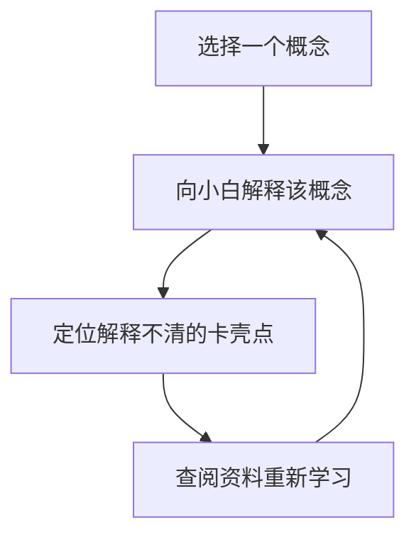

# 我的知识管理体系与高效学习方法论

在这个信息爆炸的时代，获取知识的门槛降到了历史最低，但**将知识转化为能力**的门槛却升到了历史最高。每天在各大平台收藏了无数干货，大脑却依然感到空虚，这就是典型的“收藏夹式学习”幻觉。

为了打破这种被动接收的怪圈，我耗时两年构建了这套“输入 - 内化 - 整理 - 输出”闭环学习系统。

---

## 1. 知识输入的漏斗原则

我们每天面对的信息可以分为三类：
1. **噪音信息**：热点新闻、娱乐八卦，生命周期极短。
2. **事实信息**：行业动态、数据报告，生命周期较短，需要时检索即可。
3. **元知识**：底层规律、心智模型、基础学科原理，生命周期极长。

> [!IMPORTANT]
> **漏斗原则**：将 80% 的精力集中在“元知识”和系统化书籍的输入上，通过主动过滤把噪音信息降到最低。

---

## 2. 费曼学习法：以教代学

对于重要的概念，我一律采用**费曼学习法**进行内化：



在具体的实践中，我会在本地创建一个临时文件，假想面前坐着一个完全没有该背景知识的初学者，用最通俗白话的语言去解释。

### 费曼学习法的三个核心步骤：
- **概念简化**：去除所有行业术语，用最生动的比喻来类比。
- **关联已知**：将新知识与大脑中已有的认知格栅进行连接。
- **寻找漏洞**：如果某个地方卡住了，说明在这个概念上自己存在认知盲区，需要重新研读源材料。

---

## 3. 双链笔记与知识格栅

传统的文件夹分类方式是“层级树状结构”，容易导致知识之间产生孤岛。我目前采用基于双向链接的网状笔记系统：

1. **Daily Notes（日记）**：记录当天的灵感、琐碎知识点和阅读清单。
2. **Concept Notes（原子概念卡片）**：一个笔记只记录一个独立的、最小单元的知识点。
3. **MOCs（知识地图）**：通过双向链接，将分散的概念卡片串联成网。

例如，在研究量化交易时，我的“仓位管理”概念笔记会同时被链接到“概率论基础”和“交易心理学”两个地图中。

---

## 4. 输出驱动：用项目固化认知

最好的学习就是输出。只有当你能把知识写成文章，或者写成代码做成项目时，它才真正属于你。

```javascript
// 比如在学习异步编程时，自己手写一个简单的 Promise 核心逻辑
class MyPromise {
  constructor(executor) {
    this.state = 'pending';
    this.value = undefined;
    this.callbacks = [];
    
    const resolve = (value) => {
      if (this.state === 'pending') {
        this.state = 'fulfilled';
        this.value = value;
        this.callbacks.forEach(cb => cb.onFulfilled(value));
      }
    };
    
    try {
      executor(resolve);
    } catch (err) {
      // 异常处理
    }
  }
}
```

通过这一套完整的闭环系统，我不仅提升了知识的吸收效率，也在无形中积累了大量的可复用资产。希望这套方法也能对你的学习之路有所启发。
